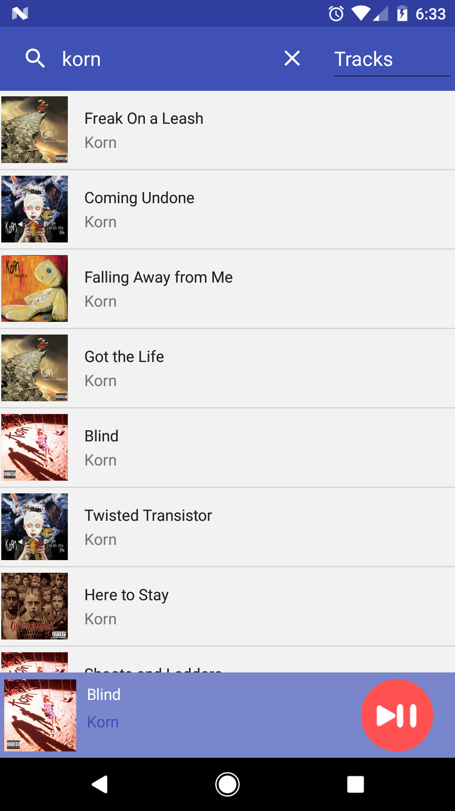
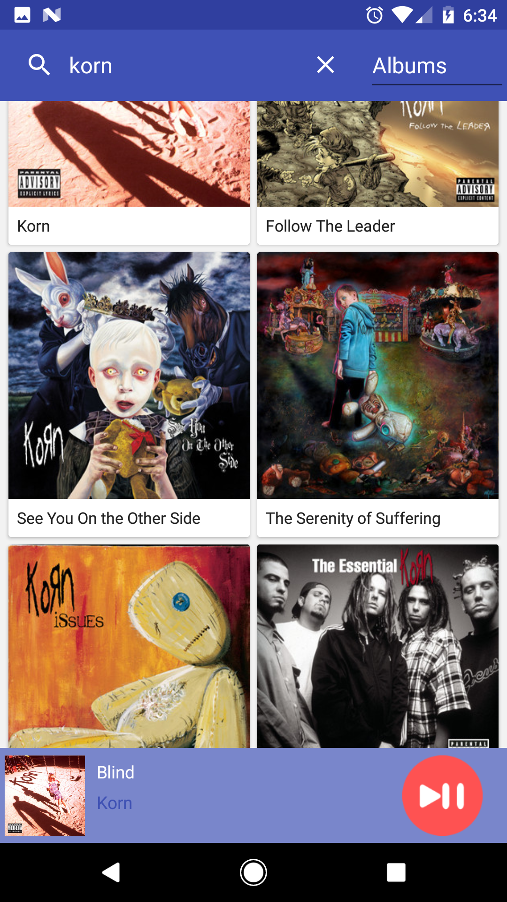
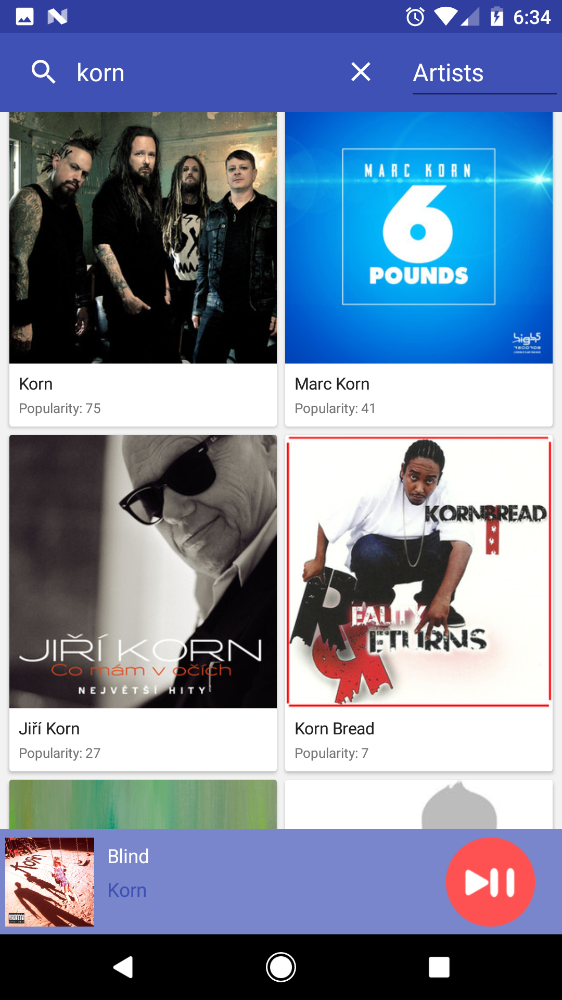

# TuneTaster
TuneTaster is an Android/iOS application which uses the <a href="https://developer.spotify.com/web-api/">Spotify Web API</a> to retrieve albums, artists and preview tracks to listen to.

<h3>Application Features</h3>

 - Discover popular albums, artists and tracks 
 
 - Listen to 30 second track previews from any album or artist 
 
 - Easy to use UI allows for quick and seamless user experience 

<h3>Screenshots</h3>
<table>
<thread>
<tr>
<th align="left">Tracks</th>
<th align="left">Albums</th>
<th align="left">Artists</th>
</tr>
</thread>

<tbody>
<tr>
<td align="left">

</td>

<td align="left">

</td>

<td align="left">

</td>
</tr>
</tbody>

</table>
