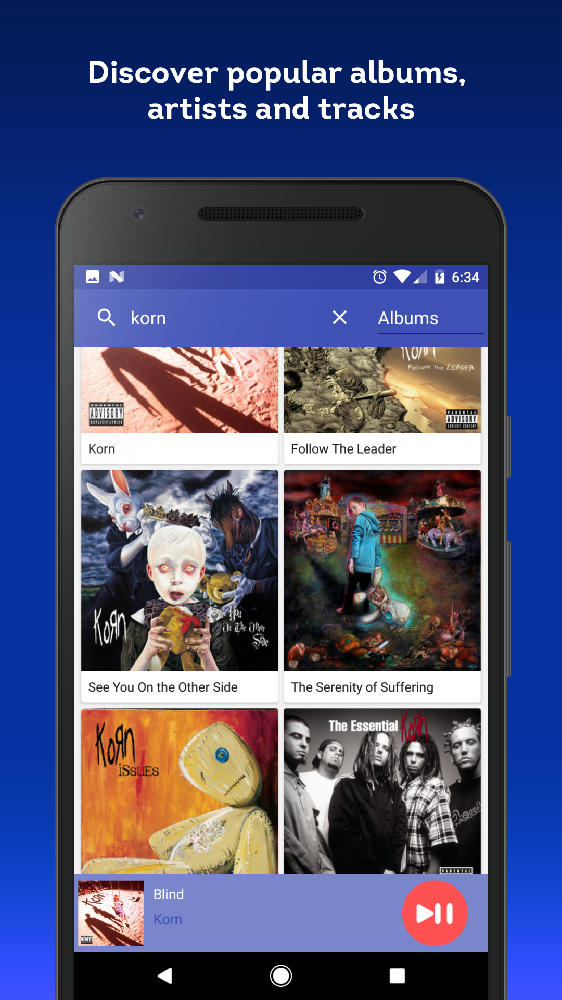
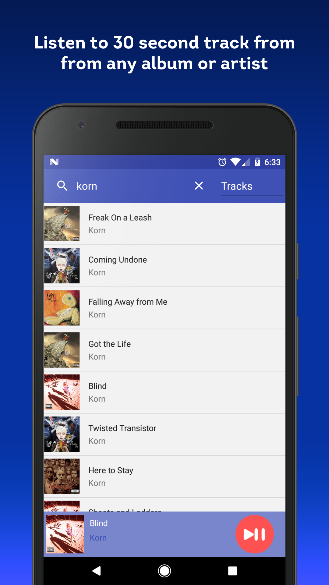
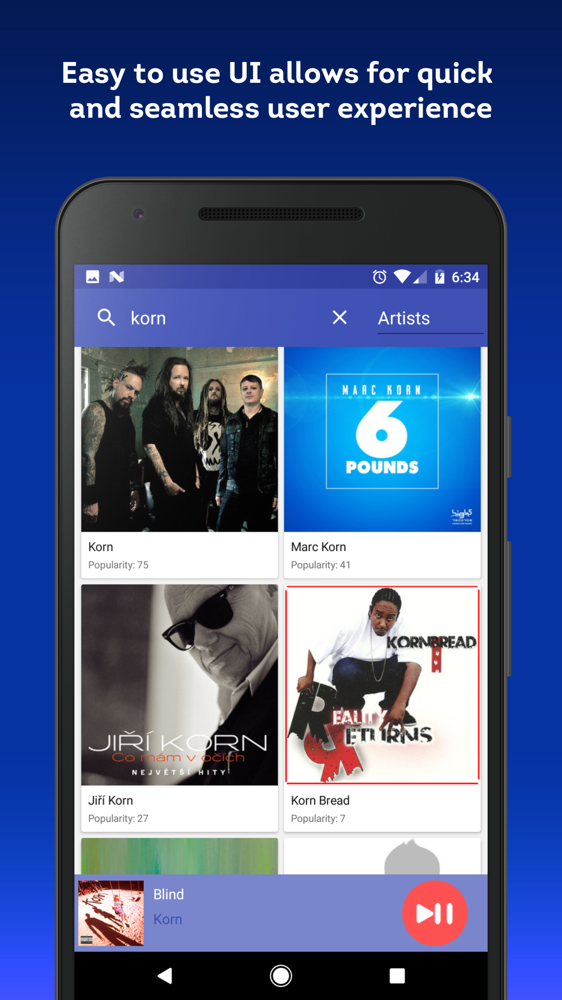

# TuneTaster
TuneTaster is an Android application which uses the <a href="https://developer.spotify.com/web-api/">Spotify Web API</a> to retrieve albums, artists and preview tracks to listen to.

<a href="https://play.google.com/store/apps/details?id=com.tunetaster.tunetaster&hl=en"> View on Google Play </a> 

<h3>Application Features</h3>

 - Discover popular albums, artists and tracks 
 
 - Listen to 30 second track previews from any album or artist 
 
 - Easy to use UI allows for quick and seamless user experience 

<h3>Screenshots</h3>
<table>
<tbody>
<tr>
<td align="left">

</td>

<td align="left">

</td>

<td align="left">

</td>
</tr>
</tbody>

</table>
